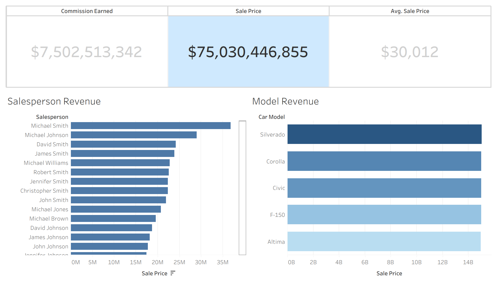

**Car Sales Business Intelligence Dashboard**

**Project Overview**
This project analyzes car dealership sales data to identify top performing sales representatives, track commission payouts per employee, and determine the most profitable vehicle models. The workflow encompasses data extraction and transformation using SQL, with the final output presented through a Tableau dashboard(png).

**Tools**
* **Data Processing & Analysis:** SQL, SQLite (DB Browser for SQLite)
* **Data Visualization:** Tableau 
* **Dataset:** [Car sales dataset from Kaggle](https://www.kaggle.com/datasets/suraj520/car-sales-data)

**Tableau Dashboard**

